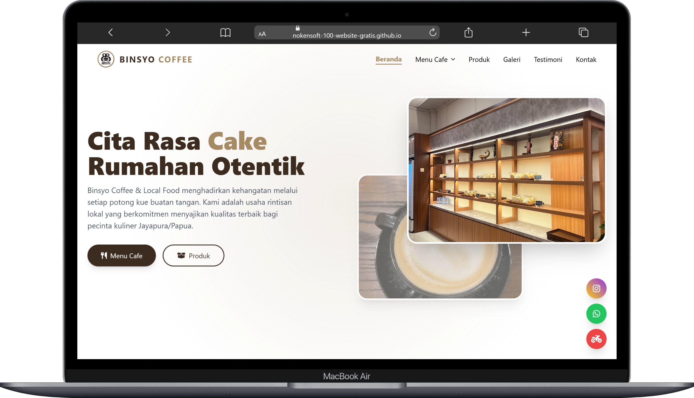
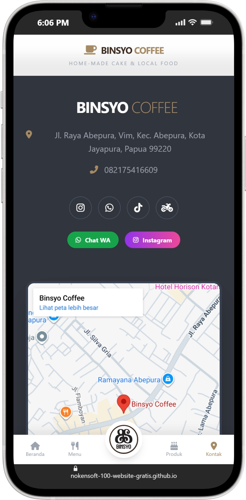
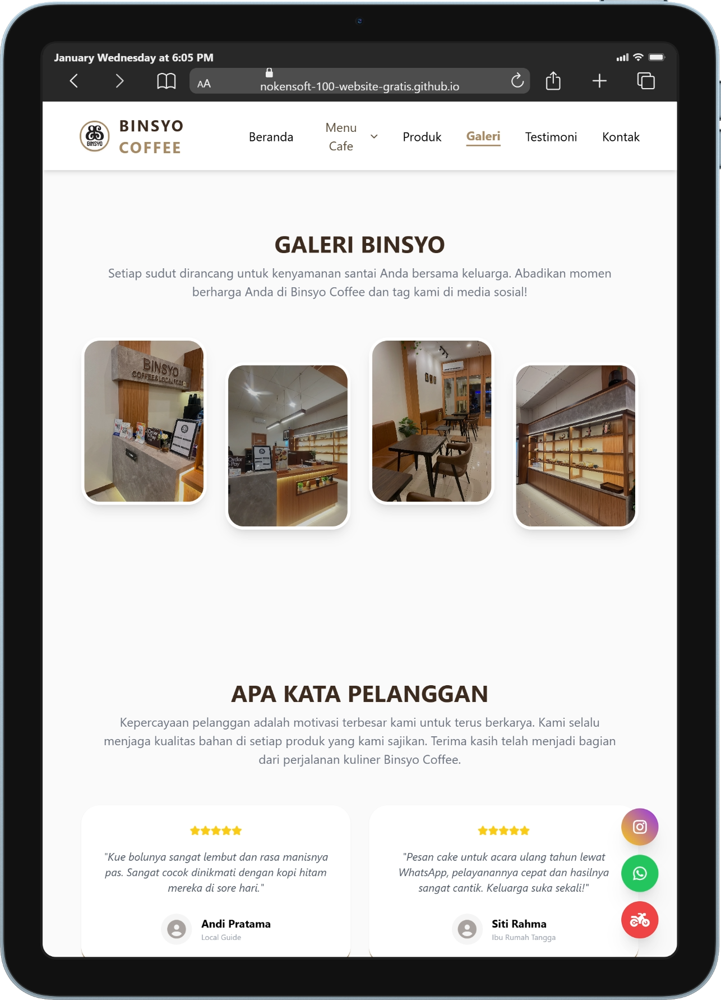

# Program 100 Website Gratis Nokensoft

## Demo Website Tana Papua Coffee & Roaster

Kunjungi di sini https://nokensoft-100-website-gratis.github.io/015-cafe-binsyo/

### Mockup tampilan destop

### Mockup tampilan mobile

### Mockup tampilan tablet

## ☕ Tana Papua Coffee and Roastery - Digital Storefront

"Kehangatan Tanah Papua dalam Setiap Gigitan dan Sesapan."

Selamat datang di repositori resmi website Tana Papua Coffee and Roastery. Proyek ini merupakan platform digital one-page modern yang dirancang khusus untuk merepresentasikan UMKM kuliner premium di Jayapura, menggabungkan estetika visual yang elegan dengan fungsionalitas pemesanan yang cepat.

## ✨ Fitur Utama (Highlight)

* Premium Dark Aesthetics: Desain High-End dengan tema hitam elegan dan aksen emas oranye, menciptakan kesan eksklusif dan profesional bagi brand.

* Dynamic Product Catalog: Sistem filter kategori berbasis Alpine.js yang memungkinkan pelanggan menjelajahi menu (Populer, Cake, Coffee, Pastry) tanpa reload halaman.

* Omnichannel Ordering: Integrasi langsung ke dua kanal penjualan utama: GoFood (untuk pengiriman instan) dan WhatsApp (untuk pemesanan personal/custom).

* Interactive Visual Gallery: Menampilkan estetika produk melalui galeri yang responsif dengan efek hover interaktif untuk meningkatkan appetite appeal.

* Mobile-First Navigation: Dilengkapi dengan bottom navigation bar khusus pengguna mobile, memastikan pengalaman belanja yang nyaman di genggaman.

* Smart Location Integration: Peta lokasi interaktif yang disesuaikan dengan skema warna website (Dark Mode Maps) untuk memudahkan pelanggan menemukan toko di Abepura.

## 🏆 Keunggulan & Keunikan

* Cita Rasa Autentik & Lokal: Menjual narasi "Home Made with Love" yang dikombinasikan dengan kekayaan rasa lokal Jayapura, Papua.

* Ultra-Responsive Design: Performa website yang sangat ringan berkat penggunaan Tailwind CSS, memastikan akses cepat bahkan dengan koneksi terbatas.

* SEO Optimized: Dilengkapi dengan meta tag strategis untuk mendominasi pencarian lokal seperti "Cake Jayapura" atau "Coffee Papua".

* Blur-Gradient Interaction: Penggunaan teknik glassmorphism dan gradasi blur yang memberikan kesan kedalaman (depth) visual yang mewah dan modern.

## 🚀 Manfaat Bagi Usaha

* Website ini bukan sekadar brosur digital, melainkan alat konversi bisnis:

* Meningkatkan Kredibilitas: Memberikan kesan bahwa Tana Papua Coffee and Roastery adalah bisnis yang profesional dan mengikuti perkembangan teknologi.

* Memperpendek Jalur Penjualan: Dengan tombol "Chat WhatsApp" dan "GoFood" yang selalu tersedia, hambatan (friction) antara melihat produk dan membeli menjadi hilang.

* Otomatisasi Informasi: Mengurangi beban tanya-jawab manual karena menu, harga, lokasi, dan testimoni sudah tersaji secara transparan dalam satu halaman.

* Konektivitas Media Sosial: Membangun ekosistem pelanggan yang loyal dengan menghubungkan traffic website langsung ke Instagram dan Facebook resmi perusahaan.

## 🛠️ Spesifikasi Teknis

* Language: Bahasa Indonesia

* Framework CSS: Tailwind CSS (Modern Utility-first)

* Interactivity: Alpine.js (Lightweight JavaScript)

* Icons: Font Awesome 6

* Architecture: Single Page Application (SPA) style with smooth scrolling.

Powered by Nokensoft www.nokensoft.com

Digitalizing Papua's Potential, One Website at a Time.